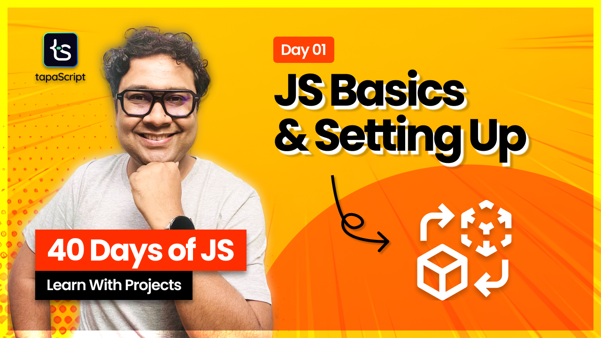

# Day 01 - 40 Days of JavaScript

## **🎯 Goal of This Lesson**

- Welcome to the "40 Days of JavaScript" series!
- How to follow the progress tracker?
- What is JavaScript, and why should you learn it?
- Setting up your development environment (VS Code, browser, and Node.js).
- Writing and running your first JavaScript code.
- Loading JavaScript in different ways (`async`, `defer`).
- Quick roadmap of what’s coming in this series.
- Task and How to Submit

## 🫶 Support
Your support means a lot.

- Please SUBSCRIBE to [tapaScript YouTube Channel](https://youtube.com/tapasadhikary) if not done already. A Big Thank You!
- Liked my work? It takes months of hard work to create quality content and present it to you. You can show your support to me with a STAR(⭐) to this repository.

    > Many Thanks to all the `Stargazers` who have supported this project with stars(⭐)

### 🤝 Sponsor My Work
I am an independent educator and open-source enthusiast who creates meaningful projects to teach programming on my YouTube Channel. **You can support my work by [Sponsoring me on GitHub](https://github.com/sponsors/atapas) or [Buy Me a Cofee](https://buymeacoffee.com/tapasadhikary)**.

## Video
Here is the video for you to go through and learn:

[](https://youtu.be/t8QXF85YovE "Video")

## **👩‍💻 🧑‍💻 Assignment Tasks**

### ✅ Task 1: Setting Up Your Environment
1. Install VS Code (if not installed).
2. Set up Live Server or open the HTML file directly in a browser.
3. Open the DevTools Console (Right-click → Inspect → Console).

### ✅ Task 2: Write Your First JavaScript Code
1. Create a new file: index.html.
2. Add a `<script>` tag inside the HTML file or link an external `script.js`.
3. Inside `script.js`, write a simple greeting program:
    ```js
    console.log("Hello, tapaScript!");
    console.log("Welcome to 40 Days of JavaScript!");
    document.write("Check the browser console for a message!");
    ```
4. Run the HTML file in the browser and check:
  - The console log prints the text.
  - The document.write() outputs text on the webpage.

### ✅ Task 3: Experiment with Different JavaScript Loading Methods
1. Add the script in `<head>`, end of the `<body>` tag.
2. Use `async` and `defer` attributes
3. Understand the difefrences.

### ✅ Task 4: Take Notes and Submit
1. Hope you have captured a good notes of your learning.
2. On the Discord, you will find `40 Days of JavaScript`. Please post about your task completion(github repo, screenshots, all) in the `task-assignments` channel.
