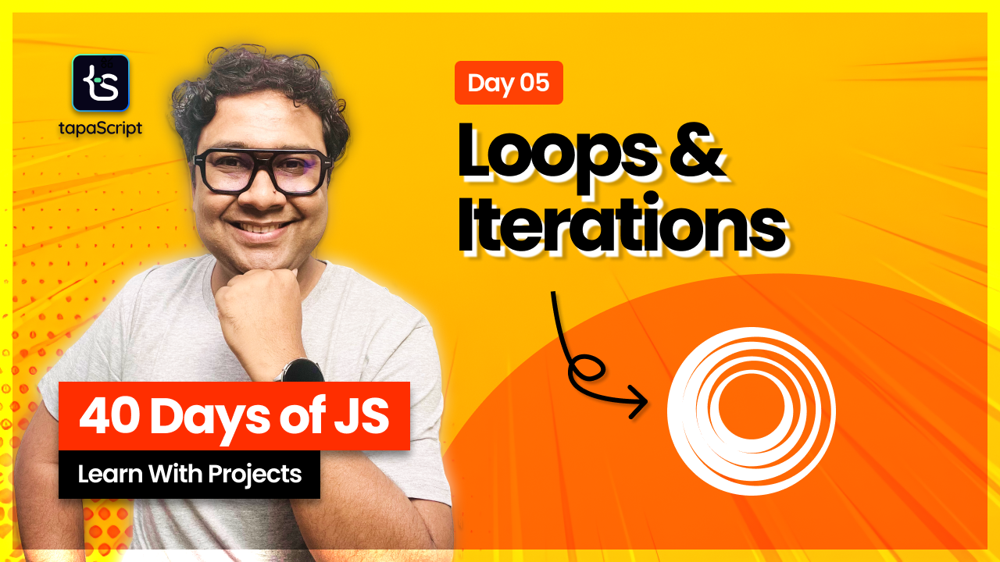

# Day 06 - 40 Days of JavaScript

## **🎯 Goal of This Lesson**

- ✅ Logic Building and DSA
- ✅ Loops in JavaScript
- ✅ The for Loop
- ✅ The for Loop Flow Chart
- ✅ for Loop Examples
- ✅ Nested Loop
- ✅ The break and continue
- ✅ Handling Multiple Counters
- ✅ The while Loop
- ✅ The do-while Loop
- ✅ Infinite Loop
- ✅ Task and Wrap Up

## 🫶 Support
Your support means a lot.

- Please SUBSCRIBE to [tapaScript YouTube Channel](https://youtube.com/tapasadhikary) if not done already. A Big Thank You!
- Liked my work? It takes months of hard work to create quality content and present it to you. You can show your support to me with a STAR(⭐) to this repository.

    > Many Thanks to all the `Stargazers` who have supported this project with stars(⭐)

### 🤝 Sponsor My Work
I am an independent educator and open-source enthusiast who creates meaningful projects to teach programming on my YouTube Channel. **You can support my work by [Sponsoring me on GitHub](https://github.com/sponsors/atapas) or [Buy Me a Cofee](https://buymeacoffee.com/tapasadhikary)**.

## Video
Here is the video for you to go through and learn:

## **👩‍💻 🧑‍💻 Assignment Tasks**

Please find the task assignments in the [Task File](./task.md).