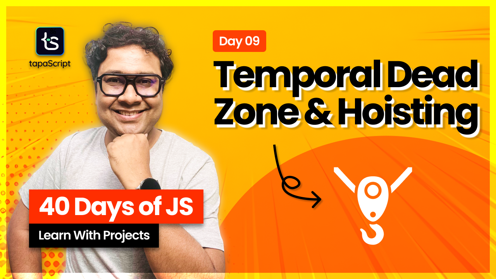

# Day 09 - 40 Days of JavaScript

## **🎯 Goal of This Lesson**

- ✅ Intro
- ✅ Misconception About Hoisting
- ✅ Variable Hoisting
- ✅ Hoisting and let and const
- ✅ Temporal Dead Zone(TDZ)
- ✅ Functional Hoisting
- ✅ Hoisting and Function As an Expression
- ✅ Task and What’s Next?

## 🫶 Support
Your support means a lot.

- Please SUBSCRIBE to [tapaScript YouTube Channel](https://youtube.com/tapasadhikary) if not done already. A Big Thank You!
- Liked my work? It takes months of hard work to create quality content and present it to you. You can show your support to me with a STAR(⭐) to this repository.

    > Many Thanks to all the `Stargazers` who have supported this project with stars(⭐)

### 🤝 Sponsor My Work
I am an independent educator and open-source enthusiast who creates meaningful projects to teach programming on my YouTube Channel. **You can support my work by [Sponsoring me on GitHub](https://github.com/sponsors/atapas) or [Buy Me a Cofee](https://buymeacoffee.com/tapasadhikary)**.

## Video
Here is the video for you to go through and learn:

## **👩‍💻 🧑‍💻 Assignment Tasks**

Please find the task assignments in the [Task File](./task.md).
