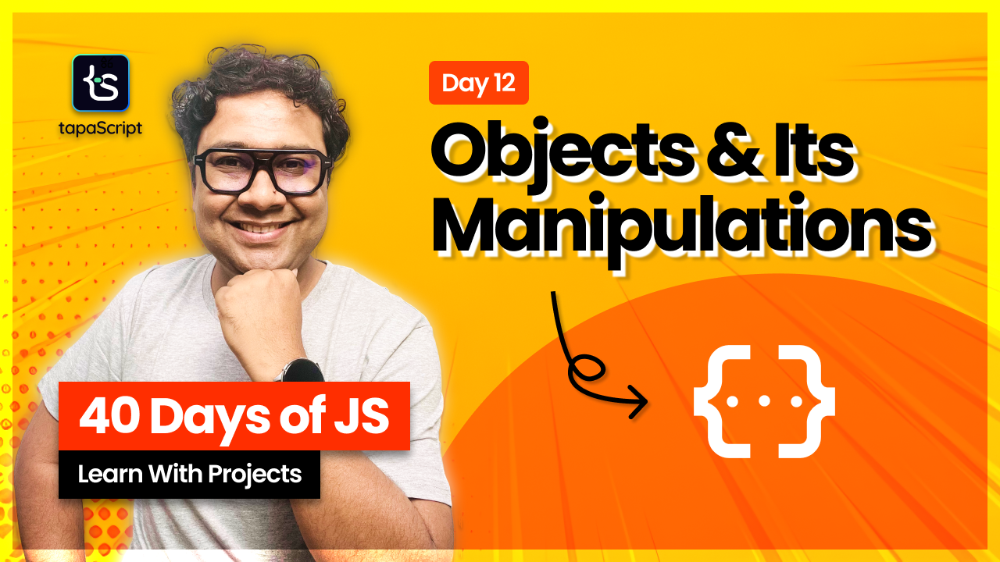

# Day 12 - 40 Days of JavaScript

## **🎯 Goal of This Lesson**

- ✅ Welcome To Day 12
- ✅ What Will We Cover?
- ✅ JavaScript Objects
- ✅ Create Objects with Literal Syntax
- ✅ Accessing Object Properties
- ✅ Adding New Property to Object
- ✅ Keys With Special Characters
- ✅ Modifying Existing Property Value
- ✅ Deleting a Key From Object
- ✅ Accessing Dynamic Key Value
- ✅ Create Object With Dynamic Values
- ✅ Constructor Function To Create Objects
- ✅ Using Object Constructor
- ✅ Using Factory Function
- ✅ Object Shorthand
- ✅ Object Methods
- ✅ Nested Objects
- ✅ The “in” operator
- ✅ The for…in loop
- ✅ Object.keys() method
- ✅ Object References
- ✅ B.R.E.A.K
- ✅ Object.assign()
- ✅ Shallow Copy vs. Deep Copy
- ✅ Convert an Object to an Array
- ✅ Concert Map or Array to Object
- ✅ Immutability with freeze()
- ✅ Immutability with seal()
- ✅ The hasOwn() Method
- ✅ What is Object Destructuring?
- ✅ Create a New Variable
- ✅ Aliases
- ✅ Nested Object Destructuring
- ✅ Destructuring to Function Parameter
- ✅ Destructure a Function Return Value
- ✅ Destructuring in Loops
- ✅ Optional Chaining
- ✅ Are You Tired?

## 🫶 Support

Your support means a lot.

- Please SUBSCRIBE to [tapaScript YouTube Channel](https://youtube.com/tapasadhikary) if not done already. A Big Thank You!
- Liked my work? It takes months of hard work to create quality content and present it to you. You can show your support to me with a STAR(⭐) to this repository.

    > Many Thanks to all the `Stargazers` who have supported this project with stars(⭐)

### 🤝 Sponsor My Work

I am an independent educator and open-source enthusiast who creates meaningful projects to teach programming on my YouTube Channel. **You can support my work by [Sponsoring me on GitHub](https://github.com/sponsors/atapas) or [Buy Me a Cofee](https://buymeacoffee.com/tapasadhikary)**.

## Video

Here is the video for you to go through and learn:

## **👩‍💻 🧑‍💻 Assignment Tasks**

Please find the task assignments in the [Task File](./task.md).
