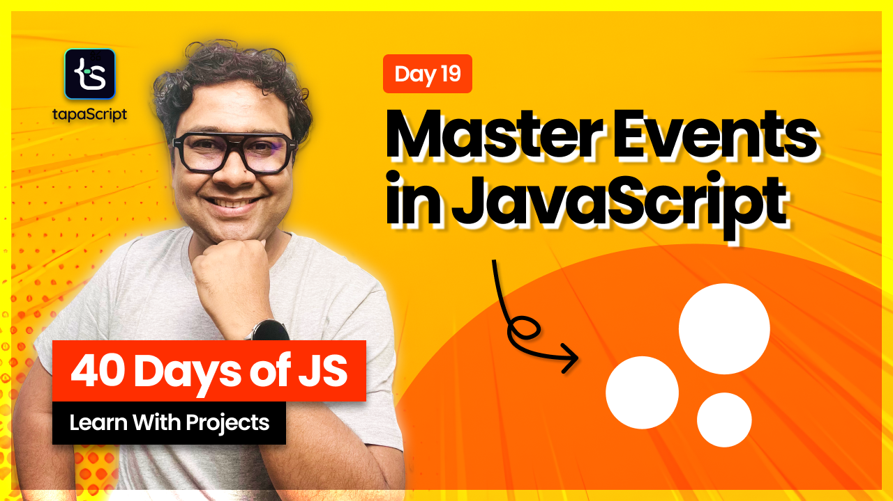

# Day 19 - 40 Days of JavaScript - JavaScript Events

## **🎯 Goal of This Lesson**

- ✅ What Will We Learn Today?
- ✅ What is an Event?
- ✅ Event Handling in markup
- ✅ Event Handling in Script
- ✅ addEventListener
- ✅ removeEventListener
- ✅ Handling Multiple Listeners
- ✅ DOM Content Loaded
- ✅ Anatomy of Event Object
- ✅ Event Bubbling
- ✅ Event Capturing
- ✅ Event Delegation
- ✅ Stop Propagation
- ✅ Preventing Defaults
- ✅ Custom Events
- ✅ Project - FAQ
- ✅ The Task and Wrap Up

## 🫶 Support

Your support means a lot.

- Please SUBSCRIBE to [tapaScript YouTube Channel](https://youtube.com/tapasadhikary) if not done already. A Big Thank You!
- Liked my work? It takes months of hard work to create quality content and present it to you. You can show your support to me with a STAR(⭐) to this repository.

    > Many Thanks to all the `Stargazers` who have supported this project with stars(⭐)

### 🤝 Sponsor My Work

I am an independent educator and open-source enthusiast who creates meaningful projects to teach programming on my YouTube Channel. **You can support my work by [Sponsoring me on GitHub](https://github.com/sponsors/atapas) or [Buy Me a Cofee](https://buymeacoffee.com/tapasadhikary)**.

## Video

Here is the video for you to go through and learn:

## **👩‍💻 🧑‍💻 Assignment Tasks**

Please find the task assignments in the [Task File](./task.md).
