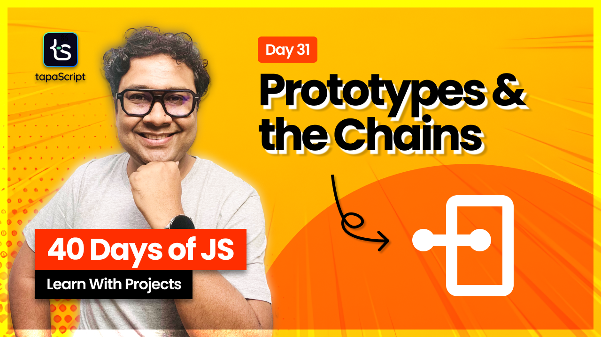

# Day 31 - 40 Days of JavaScript - Prototype & Prototype Chain

## **🎯 Goal of This Lesson**

- ✅ What Can You Expect
- ✅ JavaScript Object Literals Pattern
- ✅ Ways To Extract Values From Objects
- ✅ JavaScript Object and The const Keyword
- ✅ JavaScript Functions vs Methods
- ✅ The Constructor Function Pattern
- ✅ Composing Objects and References
- ✅ Object Prototypes
- ✅ Prototype Chain
- ✅ Constructor Function Visually
- ✅ The "prototype" Property
- ✅ The "prototype" Visually
- ✅ Prototype To Save Memory
- ✅ Prototype Chain(Lookup) Visually
- ✅ JavaScript Class Pattern
- ✅ JavaScript Class Inheritance
- ✅ The Object.create() Pattern
- ✅ How To Get Prototype Of An Object
- ✅ How To Set An Object Prototype
- ✅ The Closing Notes

## 🫶 Support

Your support means a lot.

- Please SUBSCRIBE to [tapaScript YouTube Channel](https://youtube.com/tapasadhikary) if not done already. A Big Thank You!
- Liked my work? It takes months of hard work to create quality content and present it to you. You can show your support to me with a STAR(⭐) to this repository.

    > Many Thanks to all the `Stargazers` who have supported this project with stars(⭐)

### 🤝 Sponsor My Work

I am an independent educator and open-source enthusiast who creates meaningful projects to teach programming on my YouTube Channel. **You can support my work by [Sponsoring me on GitHub](https://github.com/sponsors/atapas) or [Buy Me a Cofee](https://buymeacoffee.com/tapasadhikary)**.

## Video

Here is the video for you to go through and learn:

## **👩‍💻 🧑‍💻 Assignment Tasks**

Please find the task assignments in the [Task File](./task.md).
