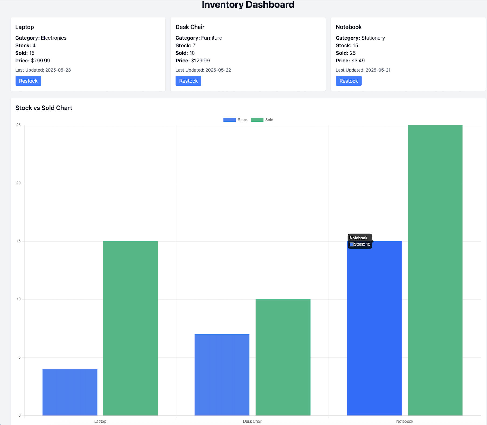

# Inventory Dashboard

Let us create an Invetory Dashboard together.



## Run the API Server

To run the API server,

```bash
cd api/inventory
npm install
npm run start
```

The API Server will run on `localhost:3001`.

## Run the UI

To run the UI,

```bash
npm install
npm run start
```

The UI will run on `localhost:3000`.

## LIVE Video

Please find the LIVE CODING video here:

[](https://www.youtube.com/live/Ub1a28GYMuA "Video")
